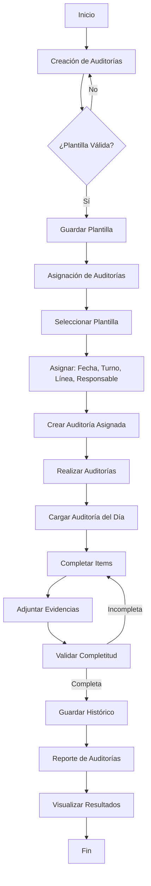

# 📋 Documentación Completa del Módulo de Auditorías

## 📑 Tabla de Contenidos

1. [Introducción](#introducción)
2. [Arquitectura del Módulo](#arquitectura-del-módulo)
3. [Mapa de Flujo del Sistema](#mapa-de-flujo-del-sistema)
4. [Estructura de Carpetas](#estructura-de-carpetas)
5. [Modelos de Datos](#modelos-de-datos)
6. [Flujos Detallados por Página](#flujos-detallados-por-página)
7. [Servicios y Reducers](#servicios-y-reducers)
8. [Guía de Desarrollo](#guía-de-desarrollo)

---

## 🎯 Introducción

El módulo de **Auditorías** es un sistema completo para gestionar el ciclo de vida de auditorías de calidad en el entorno de producción. Permite crear plantillas de auditoría, asignarlas a operadores, ejecutarlas en tiempo real y generar reportes históricos.

### Características Principales

- ✅ Creación de plantillas de auditoría personalizables
- ✅ Sistema de asignación por turnos, líneas y roles
- ✅ Ejecución de auditorías con captura de evidencias (imágenes)
- ✅ Gestión de valores y escalas de evaluación
- ✅ Reportes históricos y trazabilidad completa
- ✅ Notificaciones por email a grupos de interés

---

## 🏗️ Arquitectura del Módulo

El módulo sigue una arquitectura **Redux + Services** con separación clara de responsabilidades:

```
┌─────────────────────────────────────────────────────────────┐
│                    CAPA DE PRESENTACIÓN                      │
│  (Pages, Components, Modals - React + TypeScript)           │
└──────────────────────┬──────────────────────────────────────┘
                       │
                       ▼
┌─────────────────────────────────────────────────────────────┐
│                   CAPA DE ESTADO GLOBAL                      │
│         (Redux Slices - Gestión de Estado)                  │
└──────────────────────┬──────────────────────────────────────┘
                       │
                       ▼
┌─────────────────────────────────────────────────────────────┐
│                   CAPA DE SERVICIOS                          │
│         (Services - Comunicación con API)                    │
└──────────────────────┬──────────────────────────────────────┘
                       │
                       ▼
┌─────────────────────────────────────────────────────────────┐
│                      API BACKEND                             │
│         (Endpoints REST - Base de Datos)                     │
└─────────────────────────────────────────────────────────────┘
```

---

## 🗺️ Mapa de Flujo del Sistema

### Flujo Completo del Ciclo de Vida de una Auditoría



### Flujo de Datos entre Componentes

```
CreacionAuditoriasMain
    │
    ├─► Selecciona Planta
    │
    └─► CrudCreacionAuditorias
            │
            ├─► Paso 1: Datos Generales (Nombre, Tipo, Emails)
            │       └─► Redux: statesListDataForAuditoriasSlice
            │
            ├─► Paso 2: Configuración de Grupos e Items
            │       ├─► Crear Grupos (Bloques)
            │       ├─► Agregar Items a cada Grupo
            │       └─► Definir Nivel de Criticidad
            │
            ├─► Paso 3: Asignación de Valores
            │       ├─► Crear Lista de Valores (Ej: OK, NO OK)
            │       └─► Vincular con Items
            │
            └─► Submit: Generar DTO Completo
                    └─► AuditoriaSliceRequest.createAuditWithResults
```

---

## 📂 Estructura de Carpetas

```
auditorias/
│
├── Components/              # Componentes reutilizables específicos
│   ├── CreacionAuditorias/
│   │   └── StepperAuditorias.tsx
│   └── RealizarAuditorias/
│       └── StteperForBloqItems.tsx
│
├── Models/                  # Interfaces TypeScript
│   ├── DTO/                 # Data Transfer Objects
│   │   ├── AuditoriaEntidadesDTO.ts
│   │   └── AuditoriaEditDTO.ts
│   ├── IAuditoria.ts
│   ├── IAuditoriaAsignada.ts
│   ├── IAuditoriaGrupoItems.ts
│   ├── IAuditoriaItems.ts
│   ├── IAuditoriaValores.ts
│   ├── IAuditoriasHistorico.ts
│   └── ... (18 modelos en total)
│
├── Modules/                 # Lógica de UI
│   ├── Components/          # Componentes específicos del módulo
│   ├── Layouts/             # Layouts para páginas
│   ├── Modals/              # Ventanas emergentes
│   └── Pages/               # Páginas principales
│       ├── CreacionAuditorias/
│       ├── AsignarAuditorias/
│       ├── RealizarAuditorias/
│       └── ReporteAuditoria/
│
├── Reducers/                # Redux Slices (21 archivos)
│   ├── AuditoriaSlice.tsx
│   ├── AuditoriaAsignadaSlice.tsx
│   ├── AuditoriasHistoricoSlice.tsx
│   └── ... (gestión de estado por entidad)
│
└── Services/                # Servicios de API (18 archivos)
    ├── Auditoria.service.tsx
    ├── AuditoriaAsignada.service.tsx
    ├── AuditoriasHistorico.service.tsx
    └── ... (comunicación con backend)
```

---

## 📊 Modelos de Datos

### Entidades Principales

#### 1. **IAuditoria** (Plantilla Base)

```typescript
interface IAuditoria {
  id?: number;
  nombre: string; // Nombre de la auditoría
  tipoAuditoriaId: number; // Tipo (Ej: Calidad, Seguridad)
  numeroRegistro: string; // Código de registro
  rolId: number; // Rol responsable
  plantId: number; // Planta donde se aplica
  auditoriaMailGroup: string; // Emails para notificaciones
  auditoriaId?: number; // ID de referencia
}
```

#### 2. **IAuditoriaAsignada** (Instancia Programada)

```typescript
interface IAuditoriaAsignada extends IAuditoria {
  lineaProduccionId: number; // Línea específica
  cantidadMuestras: number; // Muestras pendientes
  cantidadMuestrasOriginal: number; // Total de muestras
  auditoriaGrupoItemsResult: IAuditoriaGrupoItemsResult[];
  auditoriaListaValoresResult: IAuditoriaListaValoresResult;
}
```

#### 3. **IAuditoriasHistorico** (Registro Completado)

```typescript
interface IAuditoriasHistorico {
  id?: number;
  operatorId: number; // Quién realizó la auditoría
  rolId: number;
  subRolId: number;
  turnoId: number;
  lineaProduccionId: number;
  auditoriaAsignadaId: number; // Referencia a la asignación
  codigoProducto: string; // Producto auditado
  estadoAuditoria: boolean; // Completada o no
  auditoriaGrupoItemsHistorico: IAuditoriaGrupoItemsHistorico[];
}
```

#### 4. **IAuditoriaGrupoItems** (Bloques de Evaluación)

```typescript
interface IAuditoriaGrupoItems {
  id?: number;
  nombre: string; // Nombre del grupo (Ej: "Inspección Visual")
  descripcion: string;
  urlArchivo?: string; // Imagen de referencia
  auditoriaGrupoItemsBloq: IAuditoriaGrupoItemsBloq[]; // Items del grupo
}
```

#### 5. **IAuditoriaItems** (Items Individuales)

```typescript
interface IAuditoriaItems {
  id?: number;
  nombre: string; // Ej: "Verificar soldadura"
  descripcion: string;
  auditoriaNivelItemId: number; // Criticidad (Alto, Medio, Bajo)
}
```

### Relaciones entre Entidades

```
IAuditoria (Plantilla)
    │
    ├─► IAuditoriaListaValores (Escala de Valores)
    │       └─► IAuditoriaValores[] (OK, NO OK, N/A)
    │
    └─► IAuditoriaGrupoItems[] (Grupos)
            └─► IAuditoriaItems[] (Items a evaluar)

IAuditoriaAsignada (Programada)
    │
    └─► Hereda de IAuditoria
    └─► Agrega: Línea, Fecha, Responsable

IAuditoriasHistorico (Completada)
    │
    ├─► Referencia a IAuditoriaAsignada
    │
    └─► IAuditoriaGrupoItemsHistorico[]
            └─► IAuditoriaItemsHistorico[]
                    ├─► valorAsignado (resultado)
                    └─► comentario (observaciones)
```

---

## 🔄 Flujos Detallados por Página

### 1️⃣ Creación de Auditorías

**Archivo:** `Modules/Pages/CreacionAuditorias/CreacionAuditoriasMain.tsx`

#### Propósito

Pantalla inicial para gestionar plantillas de auditoría.

#### Funcionalidades

- **Selección de Planta**: Filtro para ver auditorías por planta
- **Crear Nueva Auditoría**: Botón que redirige al CRUD
- **Tabla de Auditorías**: Listado de plantillas existentes con acciones:
  - 👁️ **Examinar**: Ver detalles
  - ✏️ **Editar**: Modificar plantilla
  - 🗑️ **Eliminar**: Borrar plantilla

#### Flujo de Creación

```
1. Usuario selecciona planta
2. Click en "CREAR AUDITORIA"
3. Redux limpia estados previos:
   - auditoriaAsignadaSlice.setAuditoria(null)
   - statesListDataForAuditoriasSlice (reset completo)
4. Redirección a CrudCreacionAuditorias
```

---

**Archivo:** `Modules/Pages/CreacionAuditorias/CrudCreacionAuditorias.tsx`

#### Propósito

Wizard de 3 pasos para crear/editar auditorías.

#### Paso 1: Datos Generales

**Componente:** `LayoutCrudCreacionAuditoria` (paso 1)

**Campos:**

- `nombreAuditoria`: Nombre descriptivo
- `tipoAuditoria`: Select de tipos (Calidad, Seguridad, etc.)
- `numeroRegistro`: Código de registro interno
- `listaEmails`: Emails separados por coma para notificaciones

**Redux:**

```typescript
statesListDataForAuditoriasSlice.actions.setTipoAuditoria(tipoId);
statesListDataForAuditoriasSlice.actions.setListaEmails(emails);
```

#### Paso 2: Configuración de Grupos e Items

**Componente:** `LayoutCrudCreacionAuditoria` (paso 2)

**Acciones:**

1. **Crear Grupo (Bloque)**
   - Nombre del grupo
   - Descripción
   - Imagen de referencia (opcional)
2. **Agregar Items al Grupo**
   - Nombre del item
   - Descripción
   - Nivel de criticidad (Alto/Medio/Bajo)

**Redux:**

```typescript
statesListDataForAuditoriasSlice.actions.setBloques(nuevoGrupo);
estadoDeRenderizadosSlice.actions.setCantidadBloques(cantidad);
```

**Estructura Generada:**

```typescript
IAuditoriaGrupoItems {
  nombre: "Inspección Visual",
  descripcion: "Verificación de defectos visuales",
  auditoriaGrupoItemsBloq: [
    {
      auditoriaItems: {
        nombre: "Verificar rayones",
        descripcion: "Superficie sin rayones",
        auditoriaNivelItemId: 1  // Alto
      }
    }
  ]
}
```

#### Paso 3: Asignación de Valores

**Componente:** `LayoutCrudCreacionAuditoria` (paso 3)

**Acciones:**

1. **Crear Lista de Valores Padre**

   - Nombre de la lista (Ej: "Evaluación Binaria")
   - Tipo de auditoría asociado

2. **Agregar Valores**
   - Nombre (Ej: "OK", "NO OK", "N/A")
   - Descripción
   - Puntaje (opcional)

**Redux:**

```typescript
statesListDataForAuditoriasSlice.actions.setListaValores(valores);
statesListDataForAuditoriasSlice.actions.setListaValoresPadre(listaPadre);
```

#### Submit Final

**Función:** `generarAuditoriaConResults(data)`

**Proceso:**

1. Construye `IAuditoria` con datos del Paso 1
2. Mapea `bloques` a `IAuditoriaGrupoItemsResult[]`
3. Clona `listaValores` eliminando IDs temporales
4. Crea `AuditoriaEntidadesDTO`:

```typescript
{
  auditoria: IAuditoria,
  auditoriaValores: IAuditoriaValores[],
  auditoriaListaValores: IAuditoriaListaValoresPadre,
  auditoriaGrupoItems: IAuditoriaGrupoItemsResult[]
}
```

5. Envía a `AuditoriaSliceRequest.createAuditWithResults`
6. Redirección a listado principal

---

### 2️⃣ Asignación de Auditorías

**Archivo:** `Modules/Pages/AsignarAuditorias/AsignarAuditoriasMain.tsx`

#### Propósito

Programar auditorías para ser ejecutadas por operadores.

#### Funcionalidades

- **Selección de Planta**: Filtra auditorías disponibles
- **Crear Asignación**: Modal para programar nueva auditoría
- **Tabla de Asignaciones**: Listado de auditorías programadas

#### Flujo de Asignación

```
1. Usuario selecciona planta
2. Sistema carga plantillas disponibles:
   AuditoriaSliceRequest.GetAllAuditsByRolAndPlantId
3. Click en "Crear Auditoria"
4. Modal: CrearNuevaAsignacion
   ├─► Seleccionar plantilla base
   ├─► Seleccionar línea de producción
   ├─► Seleccionar turno
   ├─► Definir cantidad de muestras
   └─► Fecha de ejecución
5. Submit crea IAuditoriaAsignada
6. Tabla se actualiza automáticamente
```

**Modal:** `Modals/AsignarAuditorias/CrearNuevaAsignacion.tsx`

**Campos del Modal:**

- `auditoriaId`: Plantilla base (Select)
- `lineaProduccionId`: Línea específica
- `turnoId`: Turno de trabajo
- `cantidadMuestras`: Número de muestras a tomar
- `fechaAsignacion`: Fecha programada

**Validaciones:**

- ✅ Todos los campos son obligatorios
- ✅ Cantidad de muestras > 0
- ✅ Fecha no puede ser anterior a hoy

---

### 3️⃣ Realizar Auditorías

**Archivo:** `Modules/Pages/RealizarAuditorias/RealizarAuditoriasMain.tsx`

#### Propósito

Pantalla para que los operadores ejecuten las auditorías asignadas.

#### Funcionalidades

- **Filtros:**
  - Planta
  - Sub-rol (solo para admins)
- **Tabla de Auditorías del Día:**
  - Muestra auditorías asignadas al turno actual
  - Columnas:
    - Fecha
    - Nombre
    - Línea
    - **Muestras Faltantes** (Ej: 5/10)
      - 🟢 Verde: Muestras pendientes
      - 🔴 Rojo: Completadas
  - Acciones:
    - ✅ **Realizar**: Ejecutar auditoría
    - ✏️ **Editar**: Solo admins

#### Lógica de Carga

```typescript
FetchApi<IAuditoriaAsignada[]>(AuditoriaAsignadaSliceRequest.getAllAuditsOfTheDay, {
  rolId: infoUser.permisos.rolId,
  subRolId: infoUser.permisos.subrolId,
  turnoId: infoUser.operator.turnoId,
  plantId: plantaSeleccionada
});
```

**Permisos:**

- **Operador Normal**: Solo ve sus auditorías asignadas
- **Admin**: Puede ver y editar todas las auditorías del rol

---

**Archivo:** `Modules/Pages/RealizarAuditorias/CompletarAuditoria.tsx`

#### Propósito

Interfaz dinámica para completar una auditoría paso a paso.

#### Estructura de la Pantalla

**Header:**

```
┌─────────────────────────────────────────────────────────┐
│ Nombre: Auditoría de Calidad Visual                    │
│ Número de Registro: AUD-2024-001                       │
├─────────────────────────────────────────────────────────┤
│ Fecha: 2024-01-27 10:30:00                             │
│ Auditor: Juan Pérez                                    │
│ Línea: Línea 1                                         │
└─────────────────────────────────────────────────────────┘
```

**Sección de Valores:**

```
Valores:
┌──────────┬──────────┬──────────┐
│ OK: 10   │ NO OK: 0 │ N/A: -   │
└──────────┴──────────┴──────────┘
```

**Campo Código de Producto:**

```
┌─────────────────────────────────────┐
│ Ingresar Código de Producto: ______ │ (Requerido)
└─────────────────────────────────────┘
```

**Stepper de Bloques:**

```
Componente: StteperForBloqItems

┌─────────────────────────────────────────────────────────┐
│  [1] Inspección Visual  →  [2] Mediciones  →  [3] ...  │
└─────────────────────────────────────────────────────────┘

Bloque Actual: "Inspección Visual"
┌─────────────────────────────────────────────────────────┐
│ Item 1: Verificar rayones                               │
│   ○ OK   ○ NO OK   ○ N/A                                │
│   Comentario: _________________________________         │
├─────────────────────────────────────────────────────────┤
│ Item 2: Verificar manchas                               │
│   ○ OK   ○ NO OK   ○ N/A                                │
│   Comentario: _________________________________         │
├─────────────────────────────────────────────────────────┤
│ Adjuntar Evidencia: [📷 Subir Imagen]                   │
└─────────────────────────────────────────────────────────┘

[← Anterior]  [Siguiente →]  [Finalizar]
```

#### Flujo de Ejecución

**1. Carga Inicial**

```typescript
// Obtiene auditoría asignada con todos los datos
FetchApi<IAuditoriaAsignada>(
  AuditoriaAsignadaSliceRequest.getAuditResultWithAllDatesById,
  params.id
)

// Extrae:
- listaValores: Escala de evaluación
- listaItems: Grupos con sus items
- valores: Opciones (OK, NO OK, etc.)
```

**2. Renderizado Dinámico**

```typescript
// Genera stepper según cantidad de grupos
const initialValuesStepper = listaItems.map((item, index) => ({
  pasoActivo: index + 1,
  activo: index === 0 // Solo el primero activo
}));
```

**3. Completar Items**
Para cada item del bloque actual:

```typescript
// Estructura del formulario
{
  bloque0: {
    item0: {
      valor: 1,           // ID del valor seleccionado
      comentario: "..."   // Observaciones
    },
    item1: { ... }
  },
  bloque1: { ... }
}
```

**4. Adjuntar Evidencias**

```typescript
interface ListaUrls {
  indexBloq: number; // Índice del bloque
  url: string | ArrayBuffer; // Preview
  file: File; // Archivo real
}

// Se almacena en estado local
setListaUrls([...listaUrls, nuevaImagen]);
```

**5. Submit Final**
**Función:** `onSubmit(data)`

**Proceso:**

```typescript
// 1. Generar Auditoría Histórico
const auditoriaHistorico: IAuditoriasHistorico = {
  operatorId: infoUser.operatorId,
  auditoriaAsignadaId: params.id,
  codigoProducto: data.codigoProducto,
  estadoAuditoria: true
};

// 2. POST Auditoría Histórico
AuditoriasHistoricoSliceRequest.PostRequest(auditoriaHistorico).then((response) => {
  // 3. Generar Grupos Históricos
  const gruposHistoricos = listaItems.map((grupo) => ({
    nombre: grupo.nombre,
    auditoriasHistoricoId: response.id,
    auditoriaItemsHistorico: [
      // Items con resultados
    ]
  }));

  // 4. POST Grupos con Items
  AuditoriaGrupoItemsHistoricoSliceRequest.MultiPostReturnList(gruposHistoricos).then((responseGrupos) => {
    // 5. Subir Imágenes (si existen)
    if (listaUrls.length > 0) {
      AuditoriaGrupoItemsHistoricoSliceRequest.MultiPostWithImages({
        auditoriaHistoricoId: response.id,
        idsGrupos: responseGrupos.map((g) => g.id),
        listaArchivos: listaUrls.map((u) => u.file)
      });
    }

    // 6. Actualizar cantidad de muestras
    // La auditoría asignada reduce cantidadMuestras en 1

    // 7. Redirección
    history.push("/main/auditorias-v2/realizar-auditorias");
  });
});
```

**Validaciones:**

- ✅ Código de producto obligatorio
- ✅ Todos los items deben tener un valor seleccionado
- ✅ Confirmación antes de enviar

---

### 4️⃣ Reporte de Auditorías

**Archivo:** `Modules/Pages/ReporteAuditoria/`

#### Propósito

Visualizar auditorías completadas y sus resultados.

#### Funcionalidades

- **Filtros:**

  - Rango de fechas
  - Planta
  - Tipo de auditoría
  - Línea de producción

- **Tabla de Históricos:**
  - Fecha de ejecución
  - Auditor
  - Línea
  - Producto auditado
  - Estado (Aprobado/Rechazado)
  - Acciones:
    - 👁️ **Examinar**: Ver resultados detallados

#### Flujo de Examen

```
1. Click en "Examinar"
2. Carga IAuditoriasHistorico completo
3. Redirección a CompletarAuditoria con params.estado = "examinar"
4. Modo solo lectura:
   - Muestra valores seleccionados
   - Muestra comentarios
   - Muestra imágenes adjuntas
   - Sin posibilidad de edición
```

---

## 🔧 Servicios y Reducers

### Patrón de Implementación

Cada entidad sigue el mismo patrón:

```
Entidad (Ej: Auditoria)
    │
    ├─► Service (Auditoria.service.tsx)
    │       └─► Métodos HTTP: GET, POST, PUT, DELETE
    │
    └─► Reducer (AuditoriaSlice.tsx)
            ├─► Estado inicial
            ├─► Thunks (acciones asíncronas)
            └─► Reducers (mutaciones de estado)
```

### Ejemplo: AuditoriaSlice

**Archivo:** `Reducers/AuditoriaSlice.tsx`

```typescript
export const AuditoriaSliceRequest = {
  // GET todas las auditorías
  getAllRequest: createAsyncThunk("auditoria/getAll", async () => await AuditoriaService.getAll()),

  // GET por rol y planta
  GetAllAuditsByRolAndPlantId: createAsyncThunk(
    "auditoria/getByRolAndPlant",
    async (params: { idPlant: number; idRol: number }) => await AuditoriaService.getByRolAndPlant(params)
  ),

  // POST crear auditoría con resultados
  createAuditWithResults: createAsyncThunk(
    "auditoria/createWithResults",
    async (dto: AuditoriaEntidadesDTO) => await AuditoriaService.createWithResults(dto)
  )
};
```

### Servicios Principales

#### 1. **Auditoria.service.tsx**

- `getAll()`: Obtener todas las plantillas
- `getById(id)`: Obtener plantilla específica
- `getByRolAndPlant(params)`: Filtrar por rol y planta
- `createWithResults(dto)`: Crear plantilla completa
- `update(id, data)`: Actualizar plantilla
- `delete(id)`: Eliminar plantilla

#### 2. **AuditoriaAsignada.service.tsx**

- `getAllAuditsOfTheDay(params)`: Auditorías del día actual
- `getAuditResultWithAllDatesById(id)`: Auditoría completa con relaciones
- `create(data)`: Crear asignación
- `updateAuditWithResults(dto)`: Actualizar auditoría asignada
- `updateSampleCount(id)`: Reducir contador de muestras

#### 3. **AuditoriasHistorico.service.tsx**

- `getAll()`: Todos los históricos
- `getById(id)`: Histórico específico
- `getByDateRange(params)`: Filtrar por fechas
- `create(data)`: Crear registro histórico

#### 4. **AuditoriaGrupoItemsHistorico.service.tsx**

- `multiPostReturnList(data)`: Crear múltiples grupos
- `multiPostWithImages(formData)`: Crear grupos con imágenes

### Redux State Management

**Estado Global:**

```typescript
{
  auditoria: {
    data: IAuditoria | null,
    dataAll: IAuditoria[],
    loading: boolean,
    error: string | null
  },

  auditoriaAsignada: {
    data: IAuditoriaAsignada | null,
    dataAll: IAuditoriaAsignada[],
    loading: boolean,
    error: string | null
  },

  listaDatosParaAuditorias: {
    listaValores: IAuditoriaValores[],
    listaValoresResult: IAuditoriaValoresResult[],
    bloques: IAuditoriaGrupoItems[] | IAuditoriaGrupoItemsResult[],
    listaValoresPadre: IAuditoriaListaValoresPadre,
    tipoAuditoria: number,
    listaEmails: string
  },

  estadoDeRenderizados: {
    cantidadBloques: number,
    bloqueSeleccionado: any
  }
}

### Mejores Prácticas

✅ **Siempre usar TypeScript**: Evita errores en tiempo de ejecución
✅ **Validar datos antes de enviar**: Usa react-hook-form
✅ **Manejar errores**: Implementa try-catch en servicios
✅ **Mostrar feedback al usuario**: Usa notificaciones
✅ **Mantener estado limpio**: Resetear Redux al cambiar de página
✅ **Documentar cambios**: Actualizar esta documentación

---

## 📝 Notas Finales

Este módulo es crítico para el sistema de calidad. Cualquier modificación debe ser:

- ✅ Testeada exhaustivamente
- ✅ Documentada
- ✅ Revisada por el equipo de calidad
- ✅ Validada en ambiente de pruebas antes de producción

**Contacto para dudas:** Equipo de Desarrollo SPP
```
